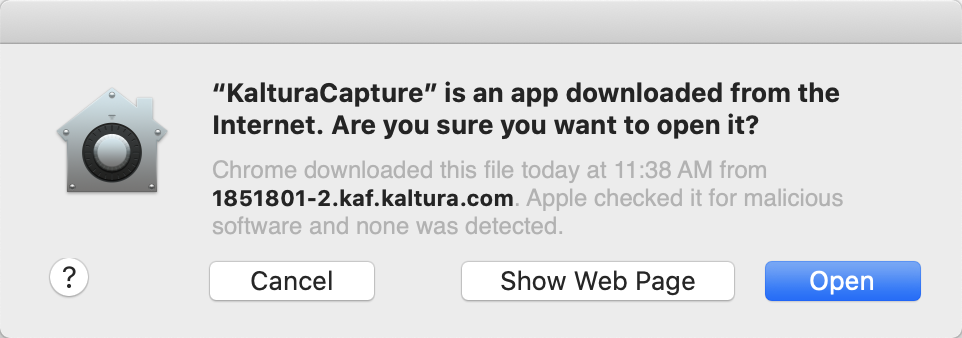
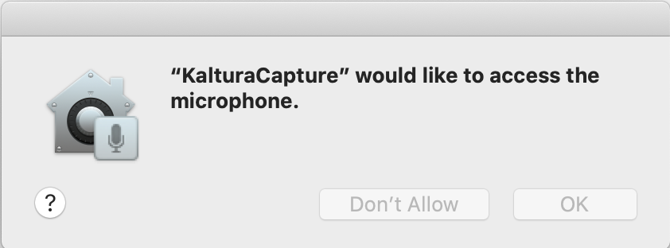
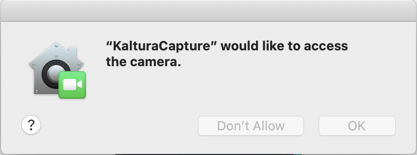
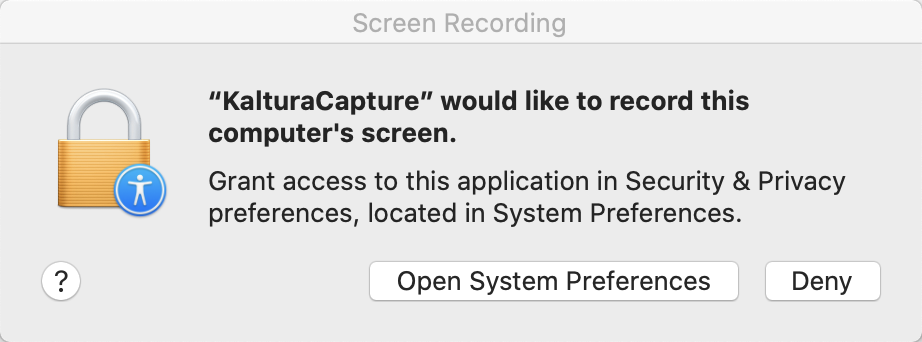
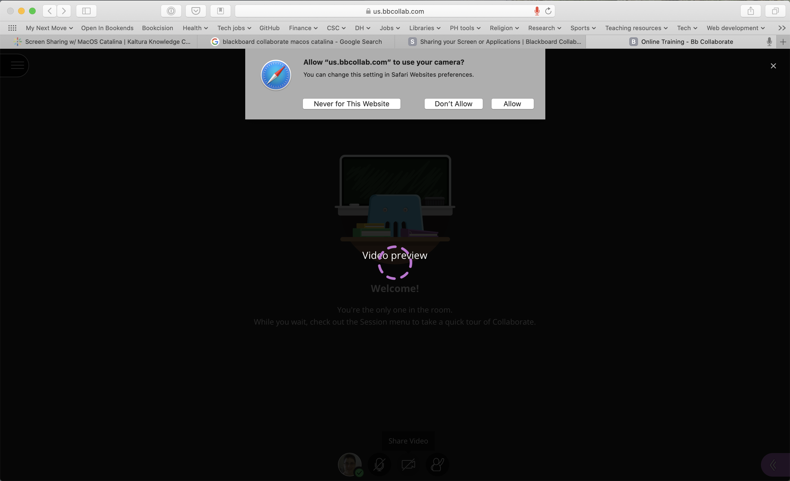
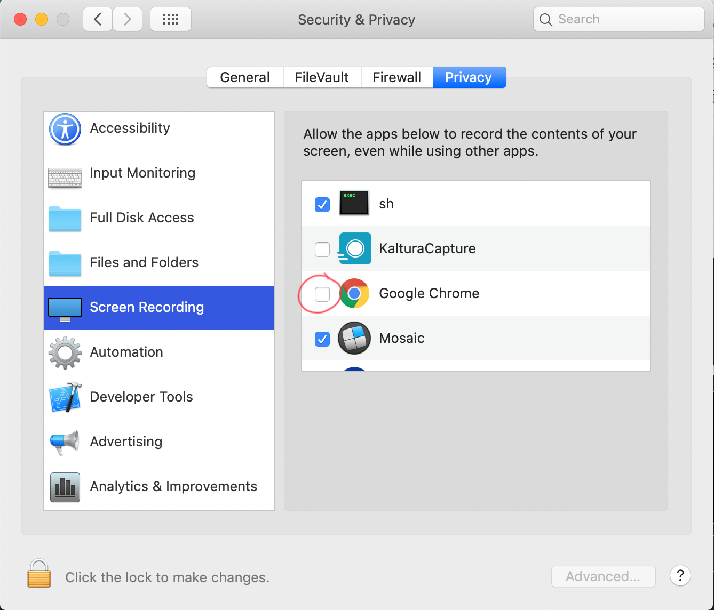

When it released macOS 10.15 (Catalina), Apple added some security features to its operating system. They require a few extra steps to get Kaltura and some features of Collaborate up and running on your Mac.

It’s best to use Chrome or Firefox for your browser when working with Kaltura.

# Kaltura on macOS 10.15 (Catalina) and later

If you haven’t installed KalturaCapture already, you’ll be prompted to download the installer file the first time you try to add a new recording in the Kaltura Media Gallery. Once the installer is downloaded, double-click it to install the software.

Once the software is installed, open it from your Applications folder. (If it refuses to run when you double-click on it, right-click or command-click instead, then choose “Open” from the context menu.)

You’ll see a dialog box warning you that KalturaCapture is an app downloaded from the Internet and asking you if you really want to open it. (You do!)

When KalturaCapture opens, it will ask for access to your computer’s microphone:

It will also want access to the computer’s camera:

Be sure to grant access for both.

Finally, you’ll be prompted to open System Preferences and grant KalturaCapture permission to record your computer’s screen:

When you click on “Open System Preferences,” you’ll be taken to the Screen Recording section of the Security & Privacy pane:

Be sure the box next to KalturaCapture is checked. (You may need to click the padlock in the lower left-hand corner and enter the password you use to log on to your computer before you can check the box.)

Once you’ve saved the settings, you’ll get a message telling you that KalturaCapture must be quit before it will be able to record your screen:

Go ahead and click “Quit Now.” The next time you try to add a new video in the Kaltura Media Gallery in Blackboard, everything should work as expected. (You may need to give your browser screen recording privileges as well; see the next section.)

# Virtual Classroom on macOS 10.15 (Catalina) and later

The first time you try to join a Collaborate session in Blackboard, you’ll likely be presented with two popup windows. One will request permission to use your computer’s microphone:

The other will request permission to use the computer’s camera:

Click “Allow” for both.

If you encounter further difficulties using Kaltura and/or Collaborate, it may be that your browser (Chrome or Firefox) doesn’t have permission to record your screen (it needs this permission for screen sharing as well as screen recording). Double-check the setting in System Preferences to be sure your browser has the permissions it needs:

If it doesn’t, click the checkbox next to it. If you don’t see your browser listed, open the Applications folder in Finder; you can click the browser’s icon there and drag it into the Security and Privacy pane.

Once your browser has permission to record your screen, everything should work as usual.